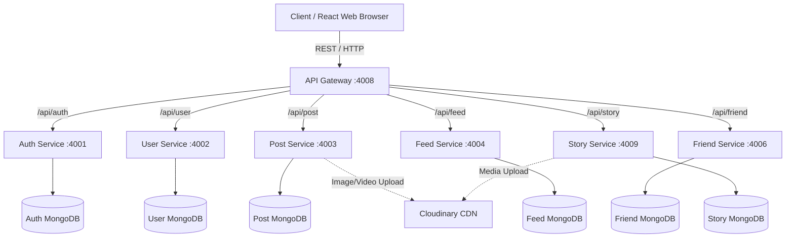
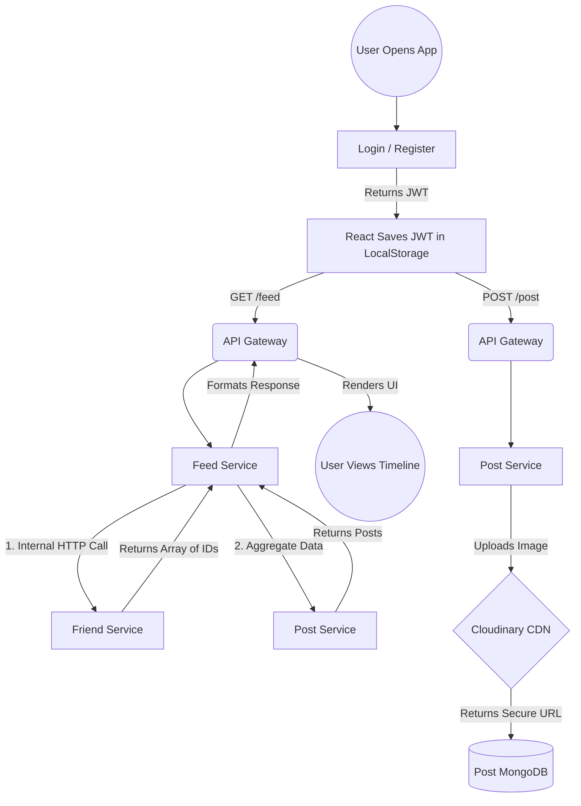

# SocialWave: Comprehensive System Design Document (HLD & LLD)

This document outlines the High-Level Design (HLD), Low-Level Design (LLD), and deep internal architectures of the SocialWave application. It is designed to be used for technical interviews, portfolio presentations, and architecture reviews.

---

# Part 1: High-Level Design (HLD)

## 1. System Overview
SocialWave is a scalable, distributed social media platform. To ensure high availability, fault tolerance, and independent scaling, the system eschews a monolithic design in favor of a **Microservices Architecture**. 

## 2. Global Architecture Diagram



## 3. Key Components
1. **React Frontend (Vite):** A Single Page Application (SPA) that acts as the presentation layer. It manages state locally and communicates exclusively with the API Gateway.
2. **API Gateway (Node.js/Express):** The single entry point for all client requests. It handles reverse proxying, routing traffic to the appropriate backend service based on the URL path.
3. **Microservices Ecosystem:** Highly decoupled Node.js services. Each service represents a specific business domain.
4. **Database-per-Service:** Each microservice has its own isolated MongoDB database to prevent tight coupling.
5. **Admin Controller:** A custom service registry acting as a circuit breaker, allowing administrators to toggle individual services on or off in real-time.

---

# Part 2: Low-Level Design (LLD) & Internals

## 1. User Journey & Core Flow Diagram
This flowchart illustrates the end-to-end journey of a user interacting with the platform and how the microservices orchestrate the response.



## 2. Deep Dive: Feed Generation Algorithm
Because SocialWave uses a Database-per-Service architecture, we cannot use a simple SQL `JOIN` to get a user's feed. Instead, the `feed-service` acts as an aggregator:
1. The Client requests the Feed.
2. The `feed-service` makes a synchronous internal HTTP request to the `friend-service` to retrieve the `followingIds` (the list of people the user follows).
3. The `feed-service` then queries the `post-service` (or its own replicated database) to fetch posts strictly matching those `followingIds`.
4. The posts are sorted by `createdAt` in descending order and returned to the client.

## 3. Deep Dive: Internal Network Topology (Docker DNS)
SocialWave relies heavily on Docker's internal networking. 
* The API Gateway does **not** route traffic to `localhost:4001`. 
* Instead, it routes traffic to `http://auth-service:4001`. 
* Docker provides a built-in DNS resolver. Because all containers share the same `docker-compose` network, they can resolve each other by their container names. This means the backend services are completely shielded from the public internet; only the Gateway is exposed.

## 4. Database Schemas (Mongoose)

### Auth Service (`auth-db`)
```javascript
const AuthSchema = new Schema({
  username: { type: String, required: true, unique: true },
  email: { type: String, required: true, unique: true },
  passwordHash: { type: String, required: true }
});
```

### Post Service (`post-db`)
```javascript
const PostSchema = new Schema({
  userId: { type: Schema.Types.ObjectId, required: true },
  username: { type: String, required: true },
  content: { type: String, default: '' },
  imageUrl: { type: String },
  likes: [{ type: Schema.Types.ObjectId }], 
  createdAt: { type: Date, default: Date.now }
});
```

### Story Service (`story-db`)
*Feature: Ephemeral Content*
```javascript
const StorySchema = new Schema({
  userId: { type: Schema.Types.ObjectId, required: true },
  mediaUrl: { type: String },
  expiresAt: { type: Date, required: true } 
});
// TTL Index: MongoDB will automatically delete documents when expiresAt is reached.
StorySchema.index({ expiresAt: 1 }, { expireAfterSeconds: 0 });
```

## 5. Security & Authentication Flow
**JWT (JSON Web Token) Verification:**
1. Upon successful login, the `auth-service` generates an asymmetric JWT and sends it to the client.
2. React stores this in `localStorage` and attaches it as a `Bearer Token` in the `Authorization` header of every subsequent API request.
3. The API Gateway passes the header through.
4. Each protected backend service uses a lightweight middleware to verify the token signature before processing the request, ensuring the API Gateway does not become a bottleneck for CPU-intensive cryptographic verification.

```javascript
// Lightweight Backend Verification Middleware
const authMiddleware = (req, res, next) => {
  const token = req.headers.authorization?.split(' ')[1];
  if (!token) return res.status(401).json({ message: 'Unauthorized' });
  try {
    req.user = jwt.verify(token, process.env.JWT_SECRET);
    next();
  } catch (err) {
    return res.status(401).json({ message: 'Invalid token' });
  }
};
```

## 6. Fault Tolerance & Edge Cases (Lazy Initialization)
**The Problem:** Because Auth and User databases are completely isolated, registering a user creates an Auth document, but *not* a User Profile document.
**The Solution:** Implemented "Lazy Initialization" via MongoDB `upsert`. 
When a user edits their profile for the first time, the `user-service` intercepts the request:
```javascript
Profile.findByIdAndUpdate(
  req.params.id, 
  { $set: { bio }, $setOnInsert: { username: req.user.username } }, 
  { upsert: true, new: true }
);
```
If the profile doesn't exist yet, MongoDB safely catches the 404 and automatically creates (inserts) a new profile on the fly. This guarantees seamless data isolation and prevents crashes without needing to rely on a complex Message Broker (like Kafka) to sync the databases on registration.
